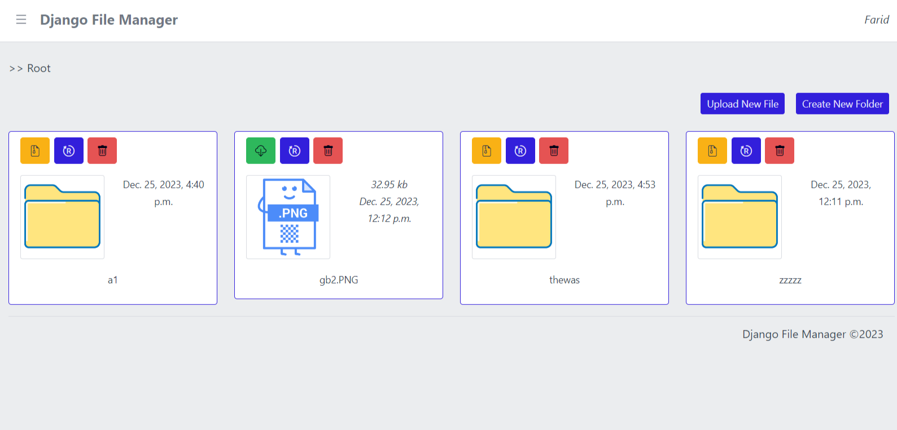

# django-fm by <a href="https://github.com/githubfarid1">Farid</a>

<div align="center">
  <a href="https://github.com/igeligel/personal-site/blob/master/LICENSE"></a>
</div>

<div style="text-align:center"></div>

## Description

> Django File Manager has been created with Django 4.2.3 with HTMX (https://htmx.org/).


## System Requirements
* Python 3.6+
* htmx
* bootstrap

  ## Dependencies
See [requirements.txt](https://github.com/githubfarid1/django-fm/blob/main/requirements.txt) for more information.

## Build Instructions

1. Clone the repository and get into the directory
```
git clone https://github.com/githubfarid1/django-fm.git
cd django-fm
```
2. Create a virtual environment
(Linux - Ubuntu)
```
python3 -m venv django-fm-venv
```
(Windows 10/11 with PowerShell)
```
python -m venv django-fm-venv
```

3. Activate virtual environment
(Linux - Ubuntu)
```
source django-fm-venv/bin/activate
```
(Windows 10/11 with PowerShell)
```
source django-fm-venv/Scripts/activate.ps1
```

4. Install modules by running 'requirements.txt'
```
pip install -r requirements.txt
```


## How To Start

1.  Run `python manage.py migrate`
2.  Run `python manage.py runserver`
3.  Open your browser using the url: [http://127.0.0.1:8000/](http://127.0.0.1:8000/)

## TO DO's

1. Download folder.
